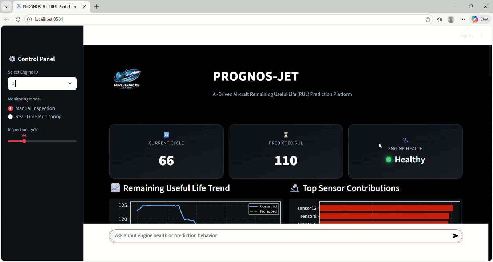

# Turbofan Engine Remaining Useful Life Prediction

Predictive maintenance is a critical component of modern industrial systems.  
This project focuses on estimating the **Remaining Useful Life (RUL)** of turbofan engines using machine learning and deep learning models trained on sensor data.

The system analyzes engine degradation patterns and predicts the number of operational cycles remaining before failure.

---

# Project Overview

The objective of this project is to develop predictive models that can estimate the remaining life of aircraft engines based on historical sensor measurements.

The models learn degradation patterns from time-series sensor data and provide accurate RUL predictions to support **preventive maintenance and reliability engineering**.

This approach helps reduce:

- unexpected engine failures  
- maintenance costs  
- system downtime

---

# Dataset

This project uses the **NASA CMAPSS (Commercial Modular Aero-Propulsion System Simulation) Dataset**.

The dataset contains simulated turbofan engine degradation data including multiple sensor readings across operational cycles.

Dataset components used in this project:

- **train_FD001.txt** – training dataset  
- **test_FD001.txt** – test dataset  
- **RUL_FD001.txt** – true remaining useful life values  

Each engine unit contains multivariate time-series sensor measurements that degrade as the engine approaches failure.

---

# Machine Learning Models Implemented

This project evaluates multiple machine learning models to predict the Remaining Useful Life (RUL) of turbofan engines.

Three models were implemented during experimentation:

### Random Forest
Random Forest was used as a **baseline ensemble learning model**.  
It provides strong performance for structured data and helps capture nonlinear relationships between sensor measurements.

### XGBoost
XGBoost was used as a **gradient boosting model** to improve predictive accuracy and model robustness.  
It served as another benchmark model for comparison.

### LSTM (Long Short-Term Memory)

The **LSTM model is the primary model implemented and deployed in this project.**

LSTM networks are specifically designed for **sequential and time-series data**, making them well-suited for modeling engine degradation over time.

Unlike traditional machine learning models, LSTM can learn **temporal dependencies between sensor readings across operational cycles**, allowing the model to capture degradation patterns more effectively.

After comparing model performance across all approaches, **LSTM demonstrated the best ability to learn long-term degradation trends**, making it the most suitable model for Remaining Useful Life prediction.

For this reason, the final deployed predictive system uses the **LSTM model trained on turbofan sensor data**.

---

# Model Selection Summary

| Model | Purpose |
|------|------|
| Random Forest | Baseline model for comparison |
| XGBoost | Gradient boosting benchmark |
| LSTM | Final selected model for RUL prediction |

The comparative analysis showed that **LSTM performs better for sequential degradation data**, which motivated its selection as the final model.

---

# Project Workflow

The overall workflow of the project includes the following steps:

1. Data loading and preprocessing  
2. Exploratory Data Analysis (EDA)  
3. Feature scaling and preparation  
4. Model training and validation  
5. Model comparison  
6. Remaining Useful Life prediction  

---

# Project Structure

```
turbofan-engine-rul-prediction
│
├── data
│   ├── train_FD001.txt
│   ├── test_FD001.txt
│   └── RUL_FD001.txt
│
├── notebooks
│   ├── EDA.ipynb
│   ├── LSTM_RUL_Modular.ipynb
│   ├── RandomForest_RUL_MODULAR_FINAL.ipynb
│   ├── XGBoost_RUL_MODULAR_FINAL.ipynb
│   └── FINAL_MODEL_COMPARISON.ipynb
│
├── models
│   └── lstm_rul_deployment.h5
│
├── rag
│   ├── build_index.py
│   ├── knowledge_base.py
│   └── rag_engine.py
│
└── model
    ├── scaler.pkl
    ├── metadata.pkl
    └── features.pkl
```

---

# Demo Video

```

```

---

# Technologies Used

Python  
NumPy  
Pandas  
Scikit-learn  
TensorFlow / Keras  
XGBoost  
Matplotlib  
Jupyter Notebook  

---

# Results

The models were evaluated based on their ability to accurately estimate the Remaining Useful Life of engines.

The **LSTM model achieved the best performance** because it captures temporal relationships within the sensor data, which are critical for modeling degradation over time.

---

# Future Improvements

Potential improvements for this project include:

- Hyperparameter optimization  
- Additional feature engineering  
- Deployment as a web-based predictive maintenance dashboard  
- Integration with real-time sensor streams  

---

# Author

**Akshayath J T**

Mechanical Engineering Graduate  
Interested in Robotics, AI, and Autonomous Systems

GitHub:  
https://github.com/AkshayathJT

---

# License

This project is released under the MIT License.
